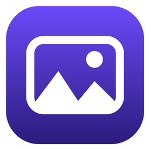

<p align="center">
  
</p>

<h1 align="center">InstaLite</h1>

<p align="center">
  Спокойный Instagram для Android: только ваши подписки, без Reels и рекомендаций.<br>
  <sub>A calm Instagram for Android: your follows only, no Reels, no recommendations. <a href="#english">English below ↓</a></sub>
</p>

---

## Зачем

Официальное приложение Instagram затягивает: вкладка Reels с бесконечной прокруткой, «Интересное»
и рекомендованные посты в ленте. InstaLite оставляет Instagram как средство связи с людьми,
на которых вы подписаны, и убирает всё, что подобрал алгоритм.

## Что есть и чего нет

| ✅ Остаётся | 🚫 Убрано |
|---|---|
| Лента **«Подписки»**: только ваши подписки, по времени | Вкладка **Reels**. Переход туда возвращает на главную |
| Stories, Direct, профили, комментарии, лайки | Сетка рекомендаций в **«Интересном»** (поиск людей работает) |
| Публикация фото из галереи | Блоки **«Рекомендации для вас»** и рекомендованные посты |
| Один рилс по ссылке от друга (`/reel/…`) | Ленты подборок по аудио из Reels |
| Открытие ссылок instagram.com из других приложений | Попытки открыть официальное приложение |
| Светлая и тёмная тема по системе | |

Размер APK около 80 КБ. Приложению нужен только доступ в интернет.

## Установка

1. Скачайте `InstaLite.apk` из раздела [**Releases**](../../releases/latest).
2. Откройте файл на телефоне и разрешите установку из этого источника.
3. Если Play Защита покажет предупреждение, нажмите **Подробнее → Всё равно установить**.
   Предупреждение появляется потому, что приложения нет в Play Маркете.
4. Войдите в свой аккаунт Instagram.

Требуется Android 7.0 или новее.

## Как это работает

InstaLite — это браузер (Android WebView), который открывает официальный сайт **instagram.com**.
После загрузки страницы в неё встраивается небольшой скрипт [`assets/inject.js`](assets/inject.js):

- открывает главную как ленту подписок (`/?variant=following`);
- возвращает на главную при переходе в `/reels/`;
- на странице `/explore/` прячет сетку рекомендованных постов, поиск оставляет;
- по подписям «Рекомендации для вас» / «Suggested for you» находит и скрывает рекомендованные блоки.

Фильтры работают только внутри приложения, ваш аккаунт и сам Instagram никак не меняются.

## Конфиденциальность

- Логин и пароль вводятся на официальном сайте Instagram. Приложение их не видит и не хранит.
- Нет аналитики, рекламы, трекеров и собственных серверов.
- Внешние ссылки открываются в вашем обычном браузере.

## Ограничения

- **Нет push-уведомлений**: веб-версия Instagram внутри WebView их не поддерживает.
- Рилсы друзей в ленте подписок остаются, это их обычные посты.
- Instagram периодически меняет сайт. Если какой-то фильтр перестанет срабатывать,
  создайте [Issue](../../issues) со скриншотом.
- Приложение не публикуется в Google Play: правила магазина запрещают приложения,
  которые в основном показывают чужой сайт без разрешения его владельца.

## Сборка из исходников

Сборка не требует Android Studio и Gradle, достаточно Ubuntu 24.04 или WSL:

```bash
sudo apt install openjdk-21-jdk-headless aapt apksigner zipalign dalvik-exchange android-sdk-platform-23
bash build.sh       # → build/InstaLite.apk
```

При первой сборке `build.sh` создаёт ключ подписи в `keystore/` (эта папка есть в `.gitignore`).
Храните ключ у себя: обновление встанет поверх старой версии, только если подписано тем же ключом.
Пароль к ключу задаётся переменной `KS_PASS`.

| Файл | Что внутри |
|---|---|
| `src/kz/instalite/app/MainActivity.java` | WebView, навигация, выбор файлов, кнопка «Назад» |
| `assets/inject.js` | Фильтры: лента подписок, скрытие Reels и рекомендаций |
| `AndroidManifest.xml`, `res/` | Манифест, тема, иконка |
| `icon_src/make_icons.py` | Генерация иконки |

## Отказ от ответственности

Это неофициальный личный проект. Он не связан с Instagram или Meta Platforms, Inc. и не одобрен ими.
Instagram — товарный знак Meta Platforms, Inc. Используйте на своё усмотрение.

## Лицензия

[MIT](LICENSE)

---

<a name="english"></a>
## English

**InstaLite** is a tiny (~80 KB) Android app that opens the official **instagram.com** website in a WebView
and removes the addictive parts:

- the home screen is always the chronological **Following** feed (`/?variant=following`);
- the **Reels** tab is disabled (navigating there takes you home). A single reel a friend sends you still opens;
- the recommended grid on **Explore** is hidden, and people search still works;
- **"Suggested for you"** blocks and suggested posts are hidden.

Stories, Direct messages, profiles, comments and posting photos keep working.
There is no tracking, no analytics and no backend. You log in on Instagram's own website.

**Install:** download `InstaLite.apk` from [Releases](../../releases/latest), allow installing from this source,
and log in. Requires Android 7.0+.

**Build:** on Ubuntu 24.04, `sudo apt install openjdk-21-jdk-headless aapt apksigner zipalign dalvik-exchange android-sdk-platform-23`, then `bash build.sh`.

**Limitations:** no push notifications; Instagram may change its site and break a filter (please open an issue).
Not on Google Play because the store bans apps that mainly wrap a third-party website.

*Unofficial project, not affiliated with or endorsed by Instagram or Meta Platforms, Inc. Instagram is a trademark of Meta Platforms, Inc.*
